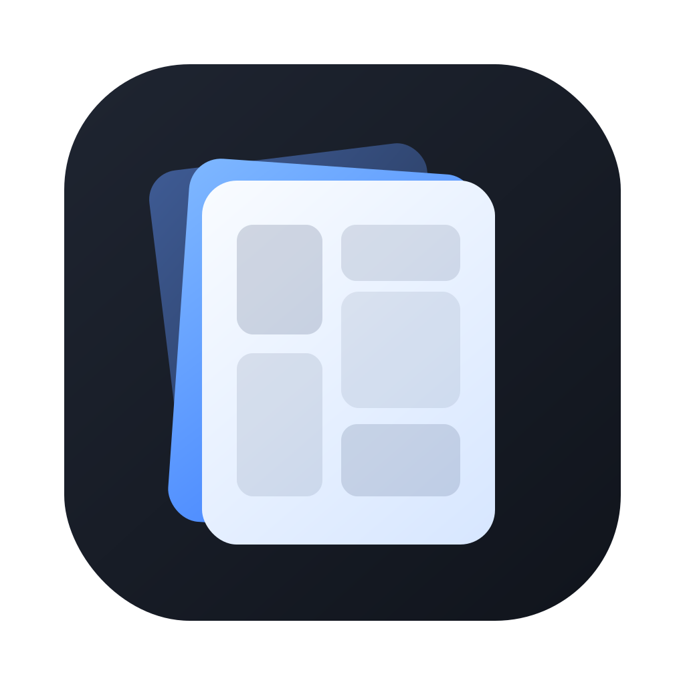

<p align="center">
  
</p>

<h1 align="center">Panely</h1>

<p align="center">
  A minimal, fast comic &amp; image viewer for macOS.<br>
  <em>macOS를 위한 미니멀한 만화/이미지 뷰어</em>
</p>

<p align="center">
  
  
  
  <a href="https://github.com/sejoung/Panely/actions/workflows/ci.yml"></a>
  <a href="https://github.com/sejoung/Panely/actions/workflows/release.yml"></a>
  <a href="https://github.com/sejoung/Panely/releases/latest"></a>
  <a href="https://github.com/sejoung/Panely/releases/latest"></a>
  <a href="https://github.com/sejoung/Panely/releases"></a>
</p>

---

## Overview

Panely is a distraction-free comic reader that gets out of your way. The UI
hides when you don't need it, the sidebar toggles in and out, and the viewer
always takes the maximum space available. Dark mode is enforced because
reading in bright chrome is fatiguing.

The viewer core is AppKit-backed (`NSScrollView` + layer-backed image views)
so pinch-zoom, scroll, and re-centering stay native and smooth even on large
pages.

## Features

### Reading
- **Single page**, **double-page spread**, and **vertical scroll** (webtoon)
  layouts — toolbar button cycles `single → double → vertical → single`
- **Left-to-right** or **right-to-left** reading (manga-friendly). RTL is
  ignored in vertical mode (webtoons are top-to-bottom) and the direction
  toggle disables itself there
- **Three fit modes** with distinct arrow icons and `⌘1`/`⌘2`/`⌘3` shortcuts:
  - **Fit to screen** — entire page visible
  - **Fit to width** — fills viewport width
  - **Fit to height** — fills viewport height
- **Vertical mode lazy windowing** — page dimensions are pre-fetched
  (header-only on folders) so the strip lays out immediately with gray
  placeholders, then real images stream in concurrently for the visible
  range and update in batched SwiftUI passes (no per-image relayout storm)
- **Zoom controls** — `⌘+` / `⌘-` / `⌘0` (reset to fit) plus toolbar
  buttons; `⌘ + scroll wheel` zooms centered at the cursor (continuous, ~1%
  per scroll unit). Trackpad pinch and double-click 1× ↔ 2× still work
- **View-size lock (`⌘L`)** — opt-in toggle that pins the current
  magnification across window/sidebar resizes and layout flips. Force
  resets (new book, explicit `⌘1`/`⌘2`/`⌘3`) still apply
- **Auto-refit on viewport resize** (when unlocked) — when the window or
  sidebar size changes, the image snaps to the new fit. Manual zoom is
  preserved by default
- **Auto-centering** — image stays centered when the viewport is larger
- **Preload ±2 pages** in paged modes so the next flip is instant
- **Progress overlay** — stage-aware messages (Opening / Extracting /
  Loading / Building vertical strip) while big sources are processed,
  all on background threads

### File support
- Open **folder**, **CBZ**, or **ZIP**
- **Series-root auto-detection** — pick a folder of volumes and the first one opens
- **Nested archive extraction** (up to 3 levels deep, recursive)
- Natural filename sort (`1, 2, 10` — not `1, 10, 2`)
- Filters non-image files and hidden entries

### Navigation
- **Keyboard-first** — `← → Space` for pages, `⌘[ ⌘]` for volumes,
  `⌘1 ⌘2 ⌘3` for fit modes, `⌘+ ⌘- ⌘0` for zoom, `⌃⌘S` to pin the sidebar,
  `⌃⌘T` to pin the toolbar, `⌘L` to lock view size, `⌘O` to open
- **Auto-hide library sidebar** — hidden by default to give the page maximum
  room. Hover the **left edge** (200 ms) and the sidebar slides in as an
  overlay (with drop shadow, no page shift). Mouse-out auto-dismisses after
  300 ms; `ESC` dismisses immediately
- **Auto-hide toolbar + slider** — float in only when the cursor is near the
  top or bottom of the viewer. `⌃⌘T` (or the pin button) keeps both visible
- **Sidebar / toolbar pin** — both follow the same `pin` ↔ `pin.fill` toggle
  pattern. Pin state persists across launches
- **Sidebar tree** — folders and archives are visually disambiguated:
  `folder` vs `doc.zipper` icons, plus a faint `.cbz` / `.zip` suffix on
  archives for quick reading
- **Vertical-mode page navigation** — `← → Space` scroll to the previous /
  next image in the strip (working from the page currently centered in
  the viewport, not the last one keyboard-navigated)
- **Volume navigation** between sibling books in the same folder
- **Recent items** — persistent across launches via security-scoped bookmarks,
  shown with the same icon scheme
- **Folder access grant** — when a single file is opened and siblings aren't
  visible, the sidebar offers a one-click prompt to pick the enclosing folder
- **Window controls** — with the title bar hidden, the top 28 px strip still
  supports native drag-to-move and double-click-to-zoom (respecting the
  system's `AppleActionOnDoubleClick` preference); an open-hand cursor
  makes the draggable region obvious

### State persistence
- **Resume where you left off** — per-book page memory with a stable key that
  survives temp-directory extractions
- **Layout + direction + fit mode + sidebar pin + toolbar pin + auto-fit
  lock** all persisted (the legacy `panely.sidebarVisible` key auto-migrates
  to the new pin flag)
- Entirely sandbox-compliant (user-selected files + app-scoped bookmarks)

## Requirements

- **macOS 14** (Sonoma) or later
- **Xcode 16** or later (for building from source)

## Getting Started

```bash
git clone https://github.com/sejoung/Panely.git
cd Panely
open Panely.xcodeproj
```

Select the **Panely** scheme and press **⌘R**.

### Dependency

Panely uses Swift Package Manager. The only external dependency is:

- **[ZIPFoundation](https://github.com/weichsel/ZIPFoundation)** — CBZ/ZIP archive reading &amp; extraction

Xcode resolves it automatically on first build.

## Shortcuts &amp; Gestures

| Input | Action |
|:------|:-------|
| `⌘O` | Open folder / CBZ / ZIP |
| `←` / `→` | Previous / next page (direction-aware in paged modes; image-by-image in vertical) |
| `Space` | Next page (or scroll to next image in vertical) |
| `⌘[` / `⌘]` | Previous / next volume |
| `⌘1` / `⌘2` / `⌘3` | Fit to screen / fit to width / fit to height |
| `⌘+` / `⌘-` | Zoom in / out (one step, viewport-centered) |
| `⌘0` | Reset zoom to current fit mode |
| `⌘ + scroll wheel` | Continuous zoom centered at cursor |
| `⌘L` | Lock / unlock view size (preserves zoom across resizes & layout flips) |
| `⌃⌘S` | Pin / unpin library sidebar |
| `⌃⌘T` | Pin / unpin toolbar (and bottom slider) |
| Hover left edge | Reveal sidebar as overlay (auto-hide mode) |
| `ESC` | Dismiss sidebar overlay (when unpinned) |
| Double-click on image | Toggle 1× ↔ 2× zoom |
| Trackpad pinch | Zoom in / out |
| Drag top 28 px strip | Move window |
| Double-click top 28 px strip | Zoom / minimize window (per system preference) |

## Testing

```bash
xcodebuild test \
  -project Panely.xcodeproj \
  -scheme Panely \
  -destination 'platform=macOS' \
  CODE_SIGN_IDENTITY="-"
```

**126 tests across 25 suites** cover:

- Pure data types (`ComicPage`, `ComicSource`, `RecentItem`, enum raw values)
- Natural-sort contract (Foundation behaviour Panely relies on)
- **Position-key stability** across temp-dir extractions (zip-in-zip scenarios)
- **FolderLoader** integration with real temp directories
- **FileNode.loadTree** scanning, sorting, empty/unreadable cases, and the
  `fileExtension` exposure used for sidebar badges
- **CBZLoader** integration with programmatically-built zip fixtures,
  including recursive nested-archive extraction
- **ImageLoader.dimensions** — header-only size reads for both file URLs
  and archive entries
- **FitCalculator** pure math across aspect ratios and zero-inputs
  (including fit-height parity with fit-screen on portrait sources)
- **NSScrollView** magnification stability on repeated fit-mode toggles
- **Viewer resize auto-fit** — magnification follows the viewport when
  unzoomed, preserves manual zoom on resize, lock (`⌘L`) preserves on
  doc-size change, force still resets, releases observer on deinit
- **CenteringClipView** — document centering when smaller than the viewport
- **SidebarMode** — pure value-type covering pinned / overlay state
  transitions (default unpinned, pin idempotency, overlay no-op while
  pinned, unpin clears any lingering overlay)
- **PageLayout cycle** — `single → double → vertical → single` ordering,
  per-mode `navigationStep`, `isContinuous` flag for vertical
- **`ReaderViewModel` paged-mode behavior** — `visiblePages` slicing,
  `setCurrentPageFromScroll` no-op outside vertical, `toggleDirection`
  works in paged
- **`ReaderViewModel` vertical-mode behavior** — `visiblePages` returns
  full strip, `setCurrentPageFromScroll` updates index, `effectiveDirection`
  is always LTR, paged → vertical transition shows loading indicator
  immediately, applyFit uses first-image reference for fit calculations
- **`ImageStackView` vertical layout** — `pageIndex(forViewportY:)`,
  `pageIndexRange(visibleIn:)`, incremental `setImages` swap (count + axis
  match → no view rebuild) vs full rebuild on axis change
- **`ViewerController`** — zoom in / out / reset against `NSScrollView`
  with min/max clamping
- **`ScrollZoomCalculator`** — multiplicative zoom factor math from
  scroll-wheel delta with min/max clamp
- **Toolbar pin state** — default unpinned, toggle flips persisted flag

Tests are organized to mirror the source tree under `PanelyTests/Core/`,
`PanelyTests/Features/Library/`, and `PanelyTests/Features/Reader/`, with
shared fixtures (including a real PNG generator) in
`PanelyTests/TestFixtures.swift`.

`RecentItem.Codable` includes a `decodeIfPresent` path for `isDirectory` so
old stored entries survive a schema bump.

## Project Structure

```
Panely/
├── PanelyApp.swift                     # @main, commands, window style
├── ContentView.swift
├── AppIcon.icns                        # generated from docs/icon/*.svg
├── DesignSystem/
│   ├── Tokens/                         # Color / Spacing / Typography / Motion
│   └── Primitives/                     # Icon button, slider
├── Features/
│   ├── Reader/
│   │   ├── ReaderViewModel.swift       # @Observable @MainActor + lazy windowing + eviction
│   │   ├── ReaderScene.swift           # ZStack layout + hot-edge reveal
│   │   ├── ViewerContainer.swift       # SwiftUI shell + AppKitImageScroller
│   │   │                               # (ImageStackView with view recycling)
│   │   ├── ViewerController.swift      # Zoom remote control (⌘+/-/0, scroll-wheel)
│   │   ├── PanelyToolbar.swift         # cycle layout / fit / zoom / pin buttons
│   │   ├── LoadingOverlay.swift
│   │   ├── PageLayout.swift            # single/double/vertical + cycle + isContinuous
│   │   ├── ReadingDirection.swift / FitMode.swift  # FitMode: 3 cases + cycle
│   │   ├── FitCalculator.swift         # pure magnification math
│   │   ├── PositionKey.swift           # stable per-book position keys
│   │   └── SidebarMode.swift           # pinned / overlay state value-type
│   └── Library/
│       ├── LibrarySidebar.swift        # pin button + extension badge + two-phase load
│       ├── FileNode.swift              # iconName + fileExtension + parallel top-level scan
│       ├── RecentItem.swift
│       └── RecentItemsStore.swift      # bookmark dedup on repeat opens
└── Core/
    └── Comic/
        ├── ComicPage.swift / ComicSource.swift / ComicPageSource.swift
        ├── FolderLoader.swift
        ├── CBZLoader.swift             # flat + recursive-nested extraction
        ├── ArchiveReader.swift         # actor around ZIPFoundation.Archive
        │                               # (loadDataPrefix for header-only reads)
        └── ImageLoader.swift           # async NSImage + dimensions(for:) header read

PanelyTests/
├── TestFixtures.swift                  # shared temp-dir / zip / PNG helpers
├── Core/Comic/                         # ComicModel, Loader extension, FolderLoader,
│                                       # CBZLoader, ImageLoaderDimensions
├── Features/Library/                   # RecentItem, FileNode
└── Features/Reader/                    # enums, NaturalSort, PositionKey, FitCalculator,
                                        # FitMagnificationStability, CenteringClipView,
                                        # ViewerResizeFit, SidebarMode, ViewerController,
                                        # ScrollZoomCalculator, ImageStackVertical,
                                        # ReaderViewModelPagedMode / VerticalMode,
                                        # ReaderViewModelToolbarPin

docs/
├── panely_prd_product_requirements_document.md
├── panely_design_system_mac_os.md
├── performance-audit.md                # prioritized perf TODO with checkboxes
└── icon/panely-icon-stacked.svg

scripts/
├── generate-app-icon.sh                # SVG → .icns pipeline
└── release.sh                          # bump + tag + push automation

.github/workflows/
├── ci.yml                              # build + test on push/PR
└── release.yml                         # zip + GitHub Release on v* tag

Info.plist                              # bundle icon reference
Panely.entitlements                     # sandbox + user-selected + bookmarks
```

## Architecture Notes

- **`@Observable` + `@MainActor`** — `ReaderViewModel` is main-actor isolated
  and orchestrates async loads via explicit stage messages to drive the
  loading overlay.
- **`nonisolated` core types** — `ComicPage`, `FolderLoader`, `CBZLoader`,
  `ImageLoader`, `FitCalculator`, `PositionKey` run off-main via
  `Task.detached`.
- **`actor ArchiveReader`** — wraps ZIPFoundation's `Archive` for
  serialised, thread-safe entry reads.
- **AppKit viewer core** — `ViewerContainer` is SwiftUI, but the scrollable
  zoomable stage is an `NSViewRepresentable` wrapping `NSScrollView` +
  `CenteringClipView` + a custom `ImageStackView`. `acceptsFirstResponder`
  is disabled so keyboard events still flow to SwiftUI's `.onKeyPress`.
- **`CenteringClipView`** overrides `constrainBoundsRect(_:)` to center the
  document when the viewport is larger — keeps the image in the middle when
  the sidebar is toggled.
- **`TitleBarPassthrough`** — a thin NSView overlaying the top 28 px of the
  viewer. `mouseDownCanMoveWindow = true` gives native window drag, an
  `NSTrackingArea` with `.cursorUpdate` shows the open-hand cursor, and a
  `mouseDown` override handles double-click zoom via
  `AppleActionOnDoubleClick`. The overlay uses `.ignoresSafeArea(edges: .top)`
  so it lines up with the actual window edge under `.hiddenTitleBar`.
- **`FitCalculator`** — physical viewport (`scrollView.contentSize`) is
  magnification-invariant, so toggling fit modes produces stable
  magnifications (no feedback loop).
- **Viewer auto-refit on resize** — `AppKitImageScroller` subscribes to its
  `NSScrollView`'s `frameDidChangeNotification`. The handler hops onto
  `MainActor`, recomputes the fit, and only writes magnification when the
  user has not manually zoomed *and* the view-size lock is off. `applyFit`
  itself decomposes its `force` flag: identity (new book) or fit-mode
  change forces reset; layout-only change defers to lock + zoom state.
- **Vertical (webtoon) lazy windowing** — entering vertical mode pre-fetches
  every page's pixel dimensions concurrently (header-only `CGImageSource`
  read; for archive entries `ArchiveReader.loadDataPrefix(maxBytes: 64 KB)`
  bails out of ZIPFoundation's extract early so we don't decompress the
  whole entry just to read width/height). Dimension fetches and decodes
  both run through chunked `withTaskGroup` capped at `min(8, cores)` to
  avoid blowing through the cooperative pool on big folders.
  `currentImages` is filled with same-sized gray placeholder `NSImage`s
  (lazy `drawingHandler` — no eager bitmap), then a bounds observer drives
  `setVisibleRange(...)` which loads real images for the visible range +
  buffer. Results commit to `currentImages` in a **single batched
  assignment** per task — one SwiftUI render per chunk instead of N.
  In-flight tasks cancel when the visible range changes again, and
  `ImageLoader.load` checks cancellation between fetch and decode so
  abandoned work stops promptly.
- **Window eviction** — when the visible range moves, pages outside
  `[range ± 10]` are swapped back to placeholders so a 1000-page strip
  doesn't pin every decoded image in memory. Recently-evicted pages
  typically restore from `NSCache` instantly when scrolled back.
- **`ImageStackView` view recycling** — the stack stores `pageFrames` for
  every page (drives all geometry queries) but only materializes
  `NSImageView` instances for pages whose frames intersect the visible
  viewport ± 1 viewport buffer. A small `viewPool` (cap 24) caches recycled
  views to avoid alloc/dealloc churn on scroll. A 1000-page strip lives in
  a tree of ~10–15 NSImageViews instead of 1000. `setImages` fast path
  (count + axis match) just mutates `imageView.image` for live views, so
  per-page lazy loads cost a pointer write each.
- **`ViewerController`** — `@Observable @MainActor` remote control owned by
  `PanelyApp` and shared via environment. Holds a weak `NSScrollView` ref
  + `baseMagnification` synced by `applyFit`, exposes `zoomIn`/`zoomOut`
  (1.25× clamped to min/max, viewport-centered) and `resetZoom` so toolbar
  buttons + menu shortcuts (`⌘+`/`⌘-`/`⌘0`) and `⌘ + scroll wheel` all hit
  the same code path.
- **`SidebarMode`** — a tiny pure value-type owning `pinned` and
  `overlayVisible`; `ReaderViewModel` holds an instance and persists only
  `pinned`. UI composes it via `sidebarVisible` (computed). Hot-edge hover
  reveal lives in `ReaderScene` as a small `HotEdgeReveal` SwiftUI view that
  fires `revealSidebarOverlay()` after a 200 ms delay; mouse-out from the
  overlay schedules a 300 ms dismiss. The toolbar follows the same pin
  pattern (`toolbarPinned`) and shares the auto-hide / pin overlay logic.
- **`PositionKey.make(for:opened:tempRoot:)`** — for sources extracted to
  `/tmp`, the key is derived from the opened URL plus the relative path
  inside the temp root so reading progress survives re-extraction.
- **`NSCache`-backed image cache** — per-page decoded `NSImage`s with
  automatic memory-pressure eviction. Preload runs a cancellable `Task`
  around the current page ±2 in paged modes. Cancellation propagates
  into `ImageLoader.load` and `preloadIfNeeded` so abandoned work doesn't
  pollute the cache during fast keyboard navigation.
- **Sidebar two-phase load** — `LibrarySidebar.reload` ships a depth-1
  scan to the UI immediately, then runs the deeper depth-3 scan in the
  background and replaces the tree once ready. `FileNode.loadTree`
  parallelizes top-level subtree scans via chunked `TaskGroup` so big
  libraries open in ~100–200 ms instead of 1–2 s.
- **Settings batch-read** — `ReaderViewModel.init` snapshots
  `UserDefaults.standard.dictionaryRepresentation()` once and reads every
  key from the in-memory dict, avoiding a dozen separate cross-process
  `UserDefaults` calls on cold start.
- **Security-scoped bookmarks** — Recent items persist across launches
  because we create `.withSecurityScope` bookmarks and resolve them on click.
  Scope lifecycle is tracked at the root URL so sibling navigation within a
  selected tree doesn't require re-prompting.
- **Distraction-free chrome** — `.windowStyle(.hiddenTitleBar)` and
  `.preferredColorScheme(.dark)` make the whole window behave like the
  viewer itself; traffic-light buttons remain but the title text is gone.

## Releasing

Releases are built and published automatically by
[`.github/workflows/release.yml`](.github/workflows/release.yml) when a tag
matching `v*` is pushed.

The easiest way is the helper script:

```bash
scripts/release.sh patch   # 1.0.0 → 1.0.1
scripts/release.sh minor   # 1.0.1 → 1.1.0
scripts/release.sh major   # 1.1.0 → 2.0.0
scripts/release.sh 1.2.3   # explicit version
scripts/release.sh         # interactive prompt
```

The script:

1. Checks the working tree is clean, on `main`, in sync with origin, and the
   tag is free on both local and remote.
2. Runs local tests (set `SKIP_TESTS=1` to skip).
3. Bumps `MARKETING_VERSION` in `project.pbxproj`.
4. Commits (`chore: release vX.Y.Z`) and creates an annotated tag.
5. Pushes `main` and the tag (set `NO_PUSH=1` to stop before pushing).

The release commit and the tag push trigger `ci.yml` (Debug build + tests)
and `release.yml` (Release build + zip + GitHub Release) respectively.
Both are intentional: CI on the bump commit verifies the release source
tree builds cleanly under Debug, and `release.yml` produces the shipped
artifact.

If you prefer doing it by hand:

```bash
git tag v1.0.0
git push origin v1.0.0
```

### CI / storage

- **CI** runs on every push/PR (skips `**/*.md` and `docs/**`), builds
  Debug with ad-hoc signing, runs all 126 tests, and uploads no artifacts —
  storage footprint is essentially zero.
- **Releases** attach a single zip (~5–10 MB) to GitHub Releases using
  `ditto` so resource forks are preserved.
- **SPM cache** speeds up subsequent runs; invalidates on `Package.resolved`
  or `project.pbxproj` changes.

## Regenerating the App Icon

If you edit `docs/icon/panely-icon-stacked.svg`, regenerate the icns:

```bash
scripts/generate-app-icon.sh
```

This rasterises the SVG at all required sizes (16–1024), embeds sRGB
profiles via ImageMagick, and produces `Panely/AppIcon.icns` via `iconutil`.
Requires `librsvg` and `imagemagick` from Homebrew.

## Roadmap

- [x] AppKit-backed viewer with native magnification
- [x] Nested-archive support (zip-in-zip)
- [x] Position memory stable across temp extractions
- [x] Library sidebar with folder access grant + pin mode
- [x] Recent items with persistent bookmarks
- [x] Loading overlay with stage messages
- [x] **Vertical scroll mode** — webtoon-style continuous scroll with lazy
      windowing (header-only dimension fetch + viewport-driven decode)
- [x] **Three fit modes** — fit-screen / fit-width / fit-height with
      `⌘1`/`⌘2`/`⌘3` and a cycling toolbar button
- [x] **Zoom controls** — `⌘+`/`⌘-`/`⌘0` + `⌘ + scroll wheel` continuous zoom
- [x] **View-size lock** — preserve magnification across resizes / mode flips
- [x] **Toolbar pin** — keep toolbar + page slider visible (`⌃⌘T`)
- [ ] **Thumbnail sidebar** — page-level preview panel
- [ ] **Bookmarks / favorites** — pin specific pages or books
- [ ] **Persistent library root** — set a home library folder once
- [ ] **WebP / HEIC** — verify first-class support end-to-end

## Contributing

Contributions are welcome. Please keep in mind:

- **Respect the design principle** — distraction-free, minimal UI first.
  Any change that adds permanent chrome should have a very good reason.
- **macOS conventions** — SF Symbols for icons, native menus, keyboard-first.
- **Sandbox-compliant** — no paths the user hasn't granted.
- **Tested logic** — any non-trivial pure function should land with a test
  in `PanelyTests/`.

Open an issue or PR at [github.com/sejoung/Panely](https://github.com/sejoung/Panely).

## License

Apache License 2.0 — see [LICENSE](LICENSE).
