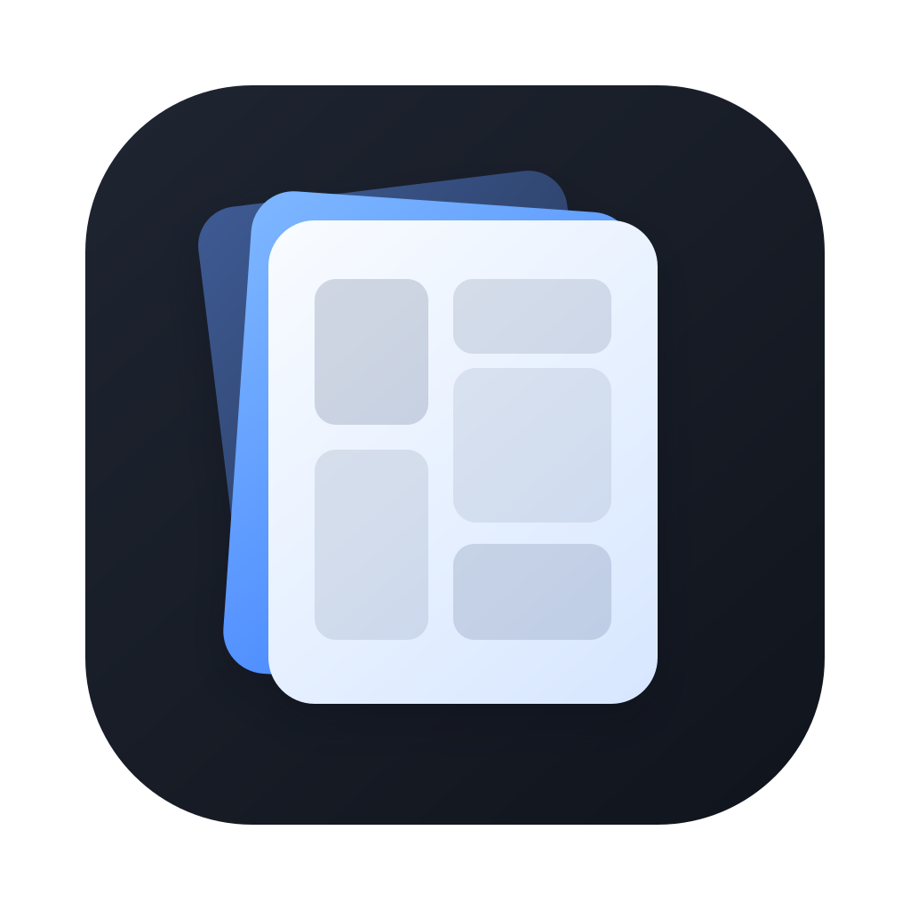

<p align="center">
  
</p>

<h1 align="center">Panely</h1>

<p align="center">
  A minimal, fast comic &amp; image viewer for macOS.<br>
  <em>macOS를 위한 미니멀한 만화/이미지 뷰어</em>
</p>

<p align="center">
  <strong>English</strong> · <a href="README.ko.md">한국어</a>
</p>

<p align="center">
  📖 <a href="docs/manual.md">User Manual</a> · <a href="docs/manual.ko.md">사용 설명서</a>
</p>

<p align="center">
  
  
  
  <a href="https://github.com/sejoung/Panely/actions/workflows/ci.yml"></a>
  <a href="https://github.com/sejoung/Panely/actions/workflows/release.yml"></a>
  <a href="https://github.com/sejoung/Panely/releases/latest"></a>
  <a href="https://github.com/sejoung/Panely/releases/latest"></a>
  <a href="https://github.com/sejoung/Panely/releases"></a>
</p>

---

## Overview

Panely is a distraction-free comic reader that gets out of your way. The UI
hides when you don't need it, the sidebar toggles in and out, and the viewer
always takes the maximum space available. Dark mode is enforced because
reading in bright chrome is fatiguing.

The viewer core is AppKit-backed (`NSScrollView` + layer-backed image views)
so pinch-zoom, scroll, and re-centering stay native and smooth even on large
pages.

## Features

### Reading
- **Single page**, **double-page spread**, and **vertical scroll** (webtoon)
  layouts — segmented toolbar control picks the mode directly (no cycle
  round-trip through `vertical`); `⌘⇧1` / `⌘⇧2` / `⌘⇧3` for keyboard
- **Left-to-right** or **right-to-left** reading (manga-friendly). RTL is
  ignored in vertical mode (webtoons are top-to-bottom) and the direction
  toggle disables itself there
- **Three fit modes** with distinct arrow icons in a segmented toolbar
  picker (one tap = direct selection) plus `⌘1`/`⌘2`/`⌘3` shortcuts:
  - **Fit to screen** — entire page visible
  - **Fit to width** — fills viewport width
  - **Fit to height** — fills viewport height

  The picker is **deselectable**: once you zoom or pan away from the fit
  magnification it stops highlighting any mode, and re-tapping the active
  mode snaps you straight back to fit (acts as "reset to fit")
- **Vertical mode lazy windowing** — page dimensions are pre-fetched
  (header-only on folders) so the strip lays out immediately with gray
  placeholders, then real images stream in concurrently for the visible
  range and update in batched SwiftUI passes (no per-image relayout storm)
- **Zoom controls** — `⌘+` / `⌘-` / `⌘0` (reset to fit) plus toolbar
  buttons; `⌘ + scroll wheel` zooms centered at the cursor (continuous, ~1%
  per scroll unit). Trackpad pinch and double-click 1× ↔ 2× still work
- **View-size lock (`⌘L`)** — opt-in toggle that pins the current
  magnification across window/sidebar resizes and layout flips. Force
  resets (new book, explicit `⌘1`/`⌘2`/`⌘3`) still apply
- **Auto-refit on viewport resize** (when unlocked) — when the window or
  sidebar size changes, the image snaps to the new fit. Manual zoom is
  preserved by default
- **Auto-centering** — image stays centered when the viewport is larger
- **Preload ±2 pages** in paged modes so the next flip is instant
- **Series continuous reading** — when the last page of a volume is
  reached and a next sibling exists, an "Up next" card surfaces over the
  bottom of the viewer with the next volume's filename and a one-click
  start. A symmetric "Previous" card appears at the top after an explicit
  backward press at page 0 — opening Vol N at page 0 stays quiet until
  the user signals intent to go further back. Forward / backward keys
  also advance volumes when the matching card is showing
- **Progress overlay** — stage-aware messages (Opening / Extracting /
  Loading / Building vertical strip) while big sources are processed,
  all on background threads
- **Reload and source-change notice** — `⌘R` reloads the current book.
  If the source changes on disk, Panely shows a small banner with
  Reload / Dismiss actions instead of moving the reader unexpectedly. The
  watcher covers archives (the file itself) **and open folders** — the
  directory plus every page image in it — so adding, removing, or editing
  pages in a folder you're reading surfaces the same prompt
- **Image error placeholders** — an unreadable page stays visible as a
  labeled error tile, so one bad image doesn't collapse the spread/strip

### File support
- Open **folder**, **CBZ**, or **ZIP**
- **Series-root auto-detection** — pick a folder of volumes and the first one opens
- **Nested archive extraction** (up to 3 levels deep, recursive, with a
  5 GB cumulative-size safety cap — guards against zip-bombs)
- **Persistent zip-in-zip cache** — extracted nested archives are content-
  addressed (SHA256 of path + size + mtime) and stored under
  `~/Library/Caches/panely-extraction-cache/` with a 10 GB LRU budget, so
  reopening the same archive is instant on subsequent launches. Source
  edits bump mtime → new key → automatic re-extraction. Cache size and
  manual cleanup live in **File → Settings…** (or **Panely → Settings…**)
  and **File → Clear Extraction Cache**.
- **Diagnostic report export** — **File → Export Diagnostic Report…** writes
  a zip with app/build and macOS versions, recent Panely logs, redacted
  open/load events, cache size, current settings, and the last reader error
  for bug reports. The same action is also available in **Settings →
  Diagnostics**. Diagnostics also exposes the current file-log size, log level,
  a logs-folder shortcut, and **File → Clear Diagnostic Logs** for clearing the
  bounded `recent-log.txt` file.
- Natural filename sort (`1, 2, 10` — not `1, 10, 2`) — applied
  consistently across loaders / scanners via the `NaturalSort` helper
- Filters non-image files and hidden entries

### Navigation
- **Keyboard-first** — `← → Space` for pages, `⌘[ ⌘]` for volumes,
  `⌘1 ⌘2 ⌘3` for fit modes, `⌘+ ⌘- ⌘0` for zoom, `⌃⌘S` to pin the sidebar,
  `⌃⌘T` to pin the toolbar, `⌘L` to lock view size, `⌘O` to open,
  and `⌘R` to reload
- **Pinned library sidebar by default** — the folder tree stays visible on a
  fresh install. Unpin with `⌃⌘S` (or the pin button) to switch to auto-hide:
  hover the **left edge** (200 ms) and the sidebar slides in as an overlay
  (with drop shadow, no page shift). Mouse-out auto-dismisses after 300 ms;
  `ESC` dismisses immediately
- **Auto-hide toolbar + slider** — float in only when the cursor is near the
  top or bottom of the viewer. `⌃⌘T` (or the pin button) keeps both visible
- **Sidebar / toolbar pin** — both follow the same `pin` ↔ `pin.fill` toggle
  pattern. Pin state persists across launches
- **Sidebar tree** — folders and archives are visually disambiguated:
  `folder` vs `doc.zipper` icons, plus a faint `.cbz` / `.zip` suffix on
  archives for quick reading
- **Reveal-active in the tree** — opening a book auto-expands its ancestor
  folders so the current volume is always visible in the sidebar, and the
  expansion follows along as you move between volumes
- **Live file tree** — the sidebar re-scans automatically when files are
  added, removed, or renamed under the library root (a recursive FSEvents
  watch, coalesced so a bulk copy refreshes once). The refresh is diffed in
  place — the tree never blanks or collapses, and expanded folders stay
  open. A **refresh button** in the sidebar header forces a re-scan on
  demand: the fallback for network volumes, where FSEvents can't deliver
  change events
- **Vertical-mode page navigation** — `← → Space` scroll to the previous /
  next image in the strip (working from the page currently centered in
  the viewport, not the last one keyboard-navigated)
- **Volume navigation** between sibling books in the same folder
- **Recent items** — persistent across launches via security-scoped bookmarks,
  shown with the same icon scheme
- **Folder access grant** — when a single file is opened and siblings aren't
  visible, the sidebar offers a one-click prompt to pick the enclosing folder
- **Window controls** — with the title bar hidden, the top 28 px strip still
  supports native drag-to-move and double-click-to-zoom (respecting the
  system's `AppleActionOnDoubleClick` preference); an open-hand cursor
  makes the draggable region obvious

### State persistence
- **Resume where you left off** — per-book page memory with a stable key that
  survives temp-directory extractions. A secondary key derived from the
  volume + file resource identifier recovers the saved position even
  when an external drive's mount path changes
- **Layout + direction + fit mode + sidebar pin + toolbar pin + auto-fit
  lock** all persisted (the legacy `panely.sidebarVisible` key auto-migrates
  to the new pin flag)
- **Bookmark / favorite safety** — page-bookmark cap (500 per book) +
  total-entry cap (200 books) keeps the store comfortably under the
  `UserDefaults` ~4 MB practical limit, preventing wholesale loss on
  decode failure. Stale security-scoped bookmarks are regenerated on
  the fly so moving a favorited file doesn't break it
- Entirely sandbox-compliant (user-selected files + app-scoped bookmarks)

## Requirements

- **macOS 14** (Sonoma) or later
- **Xcode 16** or later (for building from source)

## Getting Started

```bash
git clone https://github.com/sejoung/Panely.git
cd Panely
open Panely.xcodeproj
```

Select the **Panely** scheme and press **⌘R**.

### Dependency

Panely uses Swift Package Manager. The only external dependency is:

- **[ZIPFoundation](https://github.com/weichsel/ZIPFoundation)** — CBZ/ZIP archive reading &amp; extraction

Xcode resolves it automatically on first build.

## Finder integration

Panely registers itself as a handler for folders, `.cbz`, and `.zip` so
you can open them straight from Finder.

- **Files** (`.cbz`, `.zip`) — right-click → **Open With → Panely**
- **Folders** — macOS does not surface "Open With" for folders, so
  drag the folder onto the Panely.app icon (or its Dock icon), or use
  **File → Open With → Panely** from the menu bar

### Troubleshooting

If Panely doesn't appear in the right-click menu, or you see several
versions listed:

```bash
# 1) Find every Panely.app the system knows about
mdfind "kMDItemCFBundleIdentifier == 'io.github.sejoung.Panely'"

# 2) Move stale copies to the trash and empty it
#    (DerivedData/Debug builds can stay — they re-register on next build)

# 3) Rebuild the LaunchServices database and restart Finder
/System/Library/Frameworks/CoreServices.framework/Versions/A/Frameworks/LaunchServices.framework/Versions/A/Support/lsregister -kill -r -domain local -domain system -domain user
killall -KILL Finder
```

Keeping a Release build in `/Applications` is the most stable setup —
LaunchServices typically deprioritizes Debug builds in DerivedData.
Double-clicking a downloaded zip can leave a stray copy in Archive
Utility's temp folder that lingers in the LaunchServices cache, so
prefer right-click → "Open With → Archive Utility" (or unzip in
Terminal) and move the result straight to `/Applications`.

## Shortcuts &amp; Gestures

| Input | Action |
|:------|:-------|
| `⌘O` | Open folder / CBZ / ZIP |
| `⌘R` | Reload current book |
| `←` / `→` | Previous / next page (direction-aware; advances to the next/previous volume when the matching end-of-volume card is showing) |
| `Space` | Next page (advances to the next volume when the end-of-volume card is showing) |
| `⌘[` / `⌘]` | Previous / next volume |
| `⌘G` | Go to page… (modal prompt) |
| `⌘D` | Add / remove page bookmark |
| `⌘⇧D` | Add / remove current book from favorites |
| `⌘⇧[` / `⌘⇧]` | Previous / next page bookmark within the current book |
| `⌘⇧1` / `⌘⇧2` / `⌘⇧3` | Single page / double page / vertical scroll layout |
| `⌘1` / `⌘2` / `⌘3` | Fit to screen / fit to width / fit to height |
| `⌘+` / `⌘-` | Zoom in / out (one step, viewport-centered) |
| `⌘0` | Reset zoom to current fit mode |
| `⌘ + scroll wheel` | Continuous zoom centered at cursor |
| `⌘L` | Lock / unlock view size (preserves zoom across resizes & layout flips) |
| `⌃⌘S` | Pin / unpin library sidebar |
| `⌃⌘T` | Pin / unpin toolbar (and bottom slider) |
| `⌃⌘P` | Show / hide thumbnail sidebar |
| Hover left edge | Reveal sidebar as overlay (auto-hide mode) |
| `ESC` | Dismiss sidebar overlay (when unpinned) |
| Double-click on image | Toggle 1× ↔ 2× zoom |
| Trackpad pinch | Zoom in / out |
| Drag top 28 px strip | Move window |
| Double-click top 28 px strip | Zoom / minimize window (per system preference) |

## Testing

```bash
xcodebuild test \
  -project Panely.xcodeproj \
  -scheme Panely \
  -destination 'platform=macOS' \
  CODE_SIGN_IDENTITY="-"
```

**340 tests across 56 suites** cover:

`SnapshotGalleryTests` is discovered in normal runs but gated off unless
`scripts/generate-snapshots.sh` enables snapshot generation, so the default
`xcodebuild test` path does not render or copy manual PNGs.

- Pure data types (`ComicPage`, `ComicSource`, `RecentItem`, enum raw values)
- Natural-sort contract (Foundation behaviour Panely relies on)
- **Position-key stability** across temp-dir extractions (zip-in-zip scenarios)
- **FolderLoader** integration with real temp directories
- **FileNode.loadTree** scanning, sorting, empty/unreadable cases, and the
  `fileExtension` exposure used for sidebar badges
- **CBZLoader** integration with programmatically-built zip fixtures,
  including recursive nested-archive extraction
- **ImageLoader.dimensions** — header-only size reads for both file URLs
  and archive entries
- **FitCalculator** pure math across aspect ratios and zero-inputs
  (including fit-height parity with fit-screen on portrait sources)
- **NSScrollView** magnification stability on repeated fit-mode toggles
- **Viewer resize auto-fit** — magnification follows the viewport when
  unzoomed, preserves manual zoom on resize, lock (`⌘L`) preserves on
  doc-size change, force still resets, releases observer on deinit
- **CenteringClipView** — document centering when smaller than the viewport
- **SidebarMode / sidebar preference** — pure value-type covering pinned /
  overlay state transitions (default value unpinned, pin idempotency,
  overlay no-op while pinned, unpin clears any lingering overlay) plus
  `ReaderPreferences` default-pinned behavior and persistence
- **PageLayout cycle** — `single → double → vertical → single` ordering,
  per-mode `navigationStep`, `isContinuous` flag for vertical
- **`ReaderViewModel` paged-mode behavior** — `visiblePages` slicing,
  `setCurrentPageFromScroll` no-op outside vertical, `toggleDirection`
  works in paged
- **`ReaderViewModel` vertical-mode behavior** — `visiblePages` returns
  full strip, `setCurrentPageFromScroll` updates index, `effectiveDirection`
  is always LTR, paged → vertical transition shows loading indicator
  immediately, applyFit uses first-image reference for fit calculations
- **`ImageStackView` vertical layout** — `pageIndex(forViewportY:)`,
  `pageIndexRange(visibleIn:)`, incremental `setImages` swap (count + axis
  match → no view rebuild) vs full rebuild on axis change
- **`ViewerController`** — zoom in / out / reset against `NSScrollView`
  with min/max clamping
- **`ScrollZoomCalculator`** — multiplicative zoom factor math from
  scroll-wheel delta with min/max clamp
- **Toolbar pin state** — default unpinned, toggle flips persisted flag
- **Thumbnail sidebar toggle** — default hidden, `toggleThumbnailSidebar`
  flips persisted flag
- **Quick-jump math** — `currentPageNumber` / `currentPageRangeEndNumber`
  in single + double layouts, `jump(toPageNumber:)` clamps out-of-range
  inputs and snaps to navigation step in double mode
- **`PageBookmarksStore`** — toggle add/remove, keys isolated, sort by page
  index, next/previous navigation, remove-by-id, persistence round-trip
  through injected `KeyValueStoring`
- **`FavoritesStore`** — toggle add/remove against a real temp file,
  security-scoped bookmark resolves back to the original URL
- **`ReaderPreferences`** — `KeyValueStoring` round-trip for every persisted
  setting (layout / direction / fit / sidebar pin / etc.), invalid raw
  values fall back to defaults, legacy `panely.sidebarVisible` migrates to
  the new pin flag
- **`ReaderPositionStore`** — empty-store zero return, lazy cache hydration,
  300 ms debounce coalesces rapid `savePosition` calls, primary key beats
  file-identity fallback, mirrored writes under both keys
- **`ReaderLibraryScope`** — `contains()` accepts at-or-below paths and
  rejects sibling-prefix collisions, acquire/release lifecycle (including
  prev-URL released even when new acquire fails on a non-Powerbox URL)
- **`ReaderTempDirectory` / `ExtractionCacheStore`** — session adopt/cleanup
  against real temp dirs, contains() boundary correctness, session-candidate
  uniqueness, `cleanupStaleEntries()` mtime gating (stale removed, fresh kept,
  non-panely entries ignored), and the extraction cache: stable `cacheKey`
  per file (mtime-sensitive), `cachedEntry` hit/miss + mtime touch on hit,
  `enforceBudget()` LRU eviction when over 10 GB, `cacheSizeBytes()` /
  `clearCache(excluding:)` manual cleanup, and `cleanup()` preserves cache
  dirs while removing session dirs
- **`ReaderImageLoader`** — reset / `prepareForVerticalRebuild` /
  `cancelPreload` state transitions, `estimatedBitmapCost` uses pixel
  dimensions for Retina backing and falls back to size for placeholders,
  `lazyConcurrencyLimit` clamps to [2, 8]
- **`AppKitScrollerCoordinator`** — bounds observer fires page-index +
  range callbacks in continuous layout but no-ops in paged, programmatic
  scroll suppresses the page callback (lazy-load still proceeds), same-page
  notifications dedupe, re-attaching either observer doesn't double-fire
- **`FavoriteBook` / `PageBookmark` Codable** — round-trip fidelity plus
  forward-compat decode for legacy `FavoriteBook` JSON without `isDirectory`
- **`ReaderViewModel` bookmark guards** — `toggle*`, `canGo*Bookmark`,
  `currentPositionKey` behave as no-ops / false / nil when no source is
  loaded
- **`ThumbnailLoader`** — nil for unreachable URLs, non-nil for a real PNG,
  same `ComicPage.id` returns the cached `NSImage` via `===`, distinct
  pages get distinct cache entries
- **`ImageLoader.load`** — eager-decode pipeline (`CGImageSource` +
  `kCGImageSourceShouldCacheImmediately`), throws on non-image / missing
  files, returned NSImage's `cgImage(...)` resolves without an extra
  decode pass
- **End-of-volume / previous-volume cards** — visibility predicates,
  filename labels, `advanceForward()` / `goBackward()` dispatch, and the
  asymmetric prev-card trigger (cue stays armed only after explicit user
  intent). Includes the symmetry test that the prev card is hidden on a
  fresh open at page 0
- **Position memory in-memory mirror** — first restore hydrates the
  cache from the injected key-value store, subsequent saves and reads hit
  the in-memory dict; mirror correctly carries multiple books and reflects
  the latest write without a re-read
- **`TitleBarPassthrough`** — system double-click preference mapping
  (`zoom` / `minimize` / `none`) through the injected settings reader
- **`PanelyAppDelegate`** — `applicationShouldTerminateAfterLastWindowClosed`
  returns true so the red close button quits the app

Tests mirror the source tree: `PanelyTests/Core/Comic/`,
`PanelyTests/Features/Library/`, `PanelyTests/Features/Settings/`, and
`PanelyTests/Features/Reader/{Model, Viewer, Thumbnails, ViewModel,
ViewModel/Collaborators}`. Shared fixtures (including a real PNG generator)
live in `PanelyTests/TestFixtures.swift`; persistence tests use
`PanelyTests/TestKeyValueStore.swift`.

`RecentItem.Codable` includes a `decodeIfPresent` path for `isDirectory` so
old stored entries survive a schema bump.

## Project Structure

Each folder's top level holds only types referenced by code outside that
folder. Internals (extensions, sub-views, AppKit bridge, collaborators)
sit in subfolders so the top of any directory shows its public surface
at a glance.

```
Panely/
├── PanelyApp.swift                     # @main, window style, .commands { fileCommands + viewCommands + goCommands }
├── ContentView.swift
├── AppDependencies.swift               # injected app services (cache, bookmarks, persistence, system settings, file watching)
├── AppIcon.icns                        # generated from docs/icon/*.svg
├── Commands/                           # @CommandsBuilder extensions on PanelyApp
│   ├── PanelyApp+FileCommands.swift    # Open / Open Recent
│   ├── PanelyApp+ViewCommands.swift    # chrome / layout / fit / zoom / autofit
│   └── PanelyApp+GoCommands.swift      # page jump / bookmarks / favorites / volumes
├── Core/
│   ├── Comic/                          # loaders, ComicSource/Page, natural sort, image metadata
│   ├── Diagnostics/
│   │   ├── AppLog.swift                # swift-log facade + OSLog/file diagnostic backend
│   │   └── DiagnosticLogStore.swift    # rolling recent-log.txt cache file
│   ├── SourceChangeMonitor.swift       # DispatchSource-backed multi-URL file/folder watcher (session-guarded)
│   ├── LibraryDirectoryWatcher.swift   # FSEvents recursive watch on the library root → auto-refresh the sidebar tree
│   └── Extensions/                     # shared Foundation helpers
├── DesignSystem/
│   ├── Tokens/                         # Color / Spacing / Typography / Motion
│   └── Primitives/                     # Icon button, slider
├── Features/
│   ├── Reader/
│   │   ├── ReaderScene.swift           # ZStack: SidebarHost + ViewerArea + ThumbnailSidebarHost (~100 lines, entry view)
│   │   ├── Scene/                      # ReaderScene sub-views (one struct per file)
│   │   │   ├── HotEdgeReveal.swift
│   │   │   ├── SidebarHost.swift               # LibrarySidebar wired to viewmodel actions
│   │   │   ├── ThumbnailSidebarHost.swift      # ThumbnailSidebar wired to viewmodel actions
│   │   │   ├── ViewerArea.swift                # viewer + key handlers + overlays
│   │   │   ├── ReaderToolbarOverlay.swift
│   │   │   ├── ReaderSliderOverlay.swift
│   │   │   └── VolumeCardOverlays.swift        # end-of- + previous-volume cards
│   │   ├── Model/                      # value types & pure helpers
│   │   │   ├── PageLayout.swift        # single/double/vertical + cycle + isContinuous
│   │   │   ├── ReadingDirection.swift  # LTR / RTL
│   │   │   ├── FitMode.swift           # 3 cases + cycle
│   │   │   ├── FitCalculator.swift     # pure magnification math
│   │   │   ├── PositionKey.swift       # stable per-book position keys
│   │   │   └── SidebarMode.swift       # pinned / overlay state value-type
│   │   ├── ViewModel/                  # @Observable @MainActor reader state
│   │   │   ├── ReaderViewModel.swift           # session state + composition (~180 lines)
│   │   │   ├── Extensions/                     # logic split by concern
│   │   │   │   ├── ReaderViewModel+Navigation.swift   # page nav, Quick jump, chrome toggles
│   │   │   │   ├── ReaderViewModel+Source.swift       # load entry points + ReaderLoadIntent
│   │   │   │   ├── ReaderViewModel+LoadPipeline.swift # multi-stage load() state machine + source-change watcher
│   │   │   │   ├── ReaderViewModel+Cache.swift        # extraction-cache clear (File menu + Settings)
│   │   │   │   ├── ReaderViewModel+Toolbar.swift      # PanelyToolbar state/actions bundle
│   │   │   │   ├── ReaderViewModel+Volumes.swift      # sibling counters + volume cards
│   │   │   │   ├── ReaderViewModel+ImageLoading.swift # facade over ReaderImageLoader
│   │   │   │   └── ReaderViewModel+Bookmarks.swift    # favorites + page bookmarks integration
│   │   │   └── Collaborators/                  # composed by ReaderViewModel; each single-responsibility
│   │   │       ├── ReaderPreferences.swift     # KeyValueStoring-backed layout / fit / pins
│   │   │       ├── ReaderPositionStore.swift   # debounced per-book page memory
│   │   │       ├── FolderResolver.swift        # off-main folder/volume scanners (pure file-system walks)
│   │   │       ├── ReaderImageLoader.swift     # cache + paged refresh + vertical lazy window + preload
│   │   │       ├── ReaderImageLoadingSupport.swift # image memory cache + loading helpers
│   │   │       ├── ReaderTempDirectory.swift   # zip-in-zip session extraction lifecycle
│   │   │       ├── ExtractionCacheStore.swift  # content-addressed extraction cache (10 GB LRU)
│   │   │       └── ReaderLibraryScope.swift    # security-scope grant ownership
│   │   ├── Viewer/                     # AppKit-backed scrollable image stage
│   │   │   ├── ViewerContainer.swift           # SwiftUI shell (entry into the scroller)
│   │   │   ├── ViewerController.swift          # zoom remote (⌘+/-/0, scroll-wheel)
│   │   │   └── AppKit/                         # internal AppKit bridge
│   │   │       ├── AppKitImageScroller.swift       # NSViewRepresentable + applyFit
│   │   │       ├── AppKitScrollerCoordinator.swift # observers + state diffing
│   │   │       ├── PanelyScrollView.swift          # NSScrollView with ⌘+scroll zoom
│   │   │       ├── TitleBarPassthrough.swift       # top 28 px drag + cursor handling
│   │   │       ├── CenteringClipView.swift         # small-document centering NSClipView
│   │   │       └── ImageStackView.swift            # page frames + pooled NSImageViews
│   │   ├── Toolbar/
│   │   │   ├── PanelyToolbar.swift     # 5 button groups: chrome / layout / fit&zoom / bookmarks / nav
│   │   │   └── QuickJumpField.swift    # inline-editable page counter
│   │   ├── Overlays/
│   │   │   ├── LoadingOverlay.swift
│   │   │   ├── VolumeCardChrome.swift  # shared material/shadow/border ViewModifier
│   │   │   ├── EndOfVolumeCard.swift   # bottom card: "Up next" + start/restart
│   │   │   └── PreviousVolumeCard.swift # top card: "Previous" (intent-gated)
│   │   └── Thumbnails/
│   │       ├── ThumbnailSidebar.swift  # right-side thumbnail panel (LazyVStack)
│   │       └── ThumbnailLoader.swift   # Image I/O thumbnails + NSCache
│   ├── Settings/
│   │   ├── SettingsView.swift          # Storage + Diagnostics tabs
│   │   ├── StorageSettingsView.swift   # Storage settings UI + cache size / clear controls
│   │   ├── DiagnosticsSettingsView.swift # diagnostic report export UI
│   │   ├── DiagnosticReportExporter.swift # zip report writer
│   │   └── CacheMaintenance.swift      # clear-cache result and formatting helpers
│   └── Library/
│       ├── LibrarySidebar.swift        # pin button + extension badge + two-phase load
│       ├── LibrarySidebarModel.swift   # sidebar presentation model + expand-ancestors-of-active
│       ├── LibraryTreeLoader.swift     # injectable FileNode.loadTree wrapper
│       ├── Model/
│       │   ├── FileNode.swift          # iconName + fileExtension + parallel top-level scan
│       │   ├── RecentItem.swift        # security-scoped recent entry
│       │   ├── FavoriteBook.swift      # persistent favorite (security-scoped bookmark)
│       │   └── PageBookmark.swift      # persistent per-page bookmark
│       ├── Store/
│       │   ├── FavoritesStore.swift            # starred books (security-scoped, stale auto-refresh)
│       │   ├── PageBookmarksStore.swift        # per-book pages with per-book + total caps
│       │   └── RecentItemsStore.swift          # bookmark dedup on repeat opens
│       └── Rows/                       # sidebar row views (one struct per file)
│           ├── FileNodeRow.swift
│           ├── FavoriteRow.swift
│           ├── VolumeRow.swift
│           └── PageBookmarkRow.swift
└── Core/
    ├── Extensions/                     # shared Foundation utility extensions (DRY)
    │   ├── URL+IsAncestor.swift        # path-component-aware prefix containment
    │   └── UserDefaults+Codable.swift  # KeyValueStoring + JSON encode/decode helpers
    └── Comic/
        ├── ComicPage.swift / ComicSource.swift / ComicPageSource.swift
        ├── FolderLoader.swift
        ├── CBZLoader.swift             # flat + recursive-nested extraction + 5 GB safety cap
        ├── ArchiveReader.swift         # actor around ZIPFoundation.Archive
        │                               # (loadDataPrefix for header-only reads)
        ├── NaturalSort.swift           # locale-aware natural ordering helper
        └── ImageLoader.swift           # async NSImage + dimensions(for:) header read

PanelyTests/                            # mirrors the source tree
├── TestFixtures.swift                  # shared temp-dir / zip / PNG helpers
├── PanelyAppDelegateTests.swift
├── FileAssociationTests.swift
├── TestKeyValueStore.swift             # in-memory KeyValueStoring for persistence tests
├── Snapshots/                          # docs/screenshots/ generator (skipped in CI)
│   ├── SnapshotRenderer.swift          # NSHostingView + offscreen window → PNG
│   ├── SnapshotSampleContent.swift     # placeholder pages + LibraryFixture
│   └── SnapshotGalleryTests.swift      # 13 manual scenarios
├── Core/Comic/                         # CBZLoader, FolderLoader, ImageLoader{Load,Dimensions},
│                                       # ComicModel, LoaderExtension, NaturalSort
├── Features/Library/                   # FavoritesStore, PageBookmarksStore, RecentItem,
│                                       # FileNode, FavoriteBook, PageBookmark
├── Features/Settings/                  # CacheMaintenance, Settings UI, diagnostic report export
└── Features/Reader/
    ├── Model/                          # FitCalculator, PositionKey, ReaderEnum, SidebarMode
    ├── Viewer/                         # CenteringClipView, FitMagnificationStability,
    │                                   # ImageStackVertical, ScrollZoomCalculator,
    │                                   # ViewerController, ViewerResizeFit,
    │                                   # AppKitScrollerCoordinator, TitleBarPassthrough
    ├── Thumbnails/                     # ThumbnailLoader
    └── ViewModel/                      # 10 integration files (Bookmarks, EndOfVolume,
        │                               # Library, PagedMode, PositionMemory, QuickJump,
        │                               # SetLayout, ThumbnailSidebar, ToolbarPin,
        │                               # VerticalMode)
        └── Collaborators/              # focused unit tests for the collaborators

docs/
├── manual.md                           # English user manual (screenshot walkthrough)
├── manual.ko.md                        # Korean user manual
├── screenshots/                        # 13 PNGs generated by SnapshotGalleryTests
├── panely_design_system_mac_os.md
└── icon/panely-icon-stacked.svg

scripts/
├── generate-app-icon.sh                # SVG → .icns pipeline
├── generate-snapshots.sh               # rebuild docs/screenshots/*.png from SnapshotGalleryTests
└── release.sh                          # bump + tag + push automation

.github/workflows/
├── ci.yml                              # build + test on push/PR
└── release.yml                         # zip + GitHub Release on v* tag

Info.plist                              # bundle icon reference
Panely.entitlements                     # sandbox + user-selected + bookmarks
```

## Architecture Notes

- **`@Observable` + `@MainActor`** — `ReaderViewModel` is main-actor isolated
  and orchestrates async loads via explicit stage messages to drive the
  loading overlay. The class file holds session state + composition of focused
  **collaborators** (`ReaderPreferences`,
  `ReaderPositionStore`, `ReaderImageLoader`, `ReaderTempDirectory`,
  `ReaderLibraryScope`) plus `AppDependencies` for shared services
  (extraction cache, security-scoped bookmarks, library tree loading,
  key-value persistence, and system settings). It forwards collaborator
  properties so view callsites (`viewModel.layout`, `viewModel.currentImages`)
  stay unchanged while the underlying types own their state independently.
  Per-concern logic is split across five extensions (`+Navigation`,
  `+Source`, `+Volumes`, `+ImageLoading`, `+Bookmarks`).
- **Dependency-injected app services** — production uses `AppDependencies.live`,
  while tests can inject protocol-backed services (`ExtractionCacheManaging`,
  `SecurityScopedBookmarking`, `LibraryTreeLoading`, `KeyValueStoring`,
  `SystemSettingsReading`) without touching real app preferences, cache roots,
  or sandbox bookmarks.
- **`nonisolated` core types** — `ComicPage`, `FolderLoader`, `CBZLoader`,
  `ImageLoader`, `FitCalculator`, `PositionKey` run off-main via
  `Task.detached`.
- **`actor ArchiveReader`** — wraps ZIPFoundation's `Archive` for
  serialised, thread-safe entry reads.
- **AppKit viewer core** — `ViewerContainer` is SwiftUI, but the scrollable
  zoomable stage is `AppKitImageScroller` (`NSViewRepresentable`) wrapping
  `NSScrollView` + `CenteringClipView` + a custom `ImageStackView`.
  `acceptsFirstResponder` is disabled so keyboard events still flow to
  SwiftUI's `.onKeyPress`. `AppKitScrollerCoordinator` owns the bridge's
  AppKit-side state: last-seen SwiftUI props (for change detection), the
  two NotificationCenter observer tokens, and the `applyFit` invocation —
  so the representable itself stays focused on the SwiftUI ↔ AppKit
  handshake.
- **`CenteringClipView`** overrides `constrainBoundsRect(_:)` to center the
  document when the viewport is larger — keeps the image in the middle when
  the sidebar is toggled.
- **`TitleBarPassthrough`** — a thin NSView overlaying the top 28 px of the
  viewer. `mouseDownCanMoveWindow = true` gives native window drag; two
  `NSTrackingArea`s split the strip at the ~78 pt traffic-light inset so the
  open-hand cursor never leaks onto the close / minimize / zoom buttons,
  and a `mouseDown` override handles double-click zoom/minimize/none through
  injected `SystemSettingsReading` (`AppleActionOnDoubleClick` in production).
  The overlay uses `.ignoresSafeArea(edges: .top)` so it lines up with the
  actual window edge under `.hiddenTitleBar`.
- **`FitCalculator`** — physical viewport (`scrollView.contentSize`) is
  magnification-invariant, so toggling fit modes produces stable
  magnifications (no feedback loop).
- **Viewer auto-refit on resize** — `AppKitImageScroller` subscribes to its
  `NSScrollView`'s `frameDidChangeNotification`. The handler hops onto
  `MainActor`, recomputes the fit, and only writes magnification when the
  user has not manually zoomed *and* the view-size lock is off. `applyFit`
  itself decomposes its `force` flag: identity (new book) or fit-mode
  change forces reset; layout-only change defers to lock + zoom state.
- **Vertical (webtoon) lazy windowing** — entering vertical mode pre-fetches
  every page's pixel dimensions concurrently (header-only `CGImageSource`
  read; for archive entries `ArchiveReader.loadDataPrefix(maxBytes: 64 KB)`
  bails out of ZIPFoundation's extract early so we don't decompress the
  whole entry just to read width/height). Dimension fetches and decodes
  both run through chunked `withTaskGroup` capped at `min(8, cores)` to
  avoid blowing through the cooperative pool on big folders.
  `currentImages` is filled with same-sized gray placeholder `NSImage`s
  (lazy `drawingHandler` — no eager bitmap), then a bounds observer drives
  `setVisibleRange(...)` which loads real images for the visible range +
  buffer. Results commit to `currentImages` in a **single batched
  assignment** per task — one SwiftUI render per chunk instead of N.
  In-flight tasks cancel when the visible range changes again, and
  `ImageLoader.load` checks cancellation between fetch and decode so
  abandoned work stops promptly.
- **Window eviction** — when the visible range moves, pages outside
  `[range ± 10]` are swapped back to placeholders so a 1000-page strip
  doesn't pin every decoded image in memory. Recently-evicted pages
  typically restore from `NSCache` instantly when scrolled back.
- **`ImageStackView` view recycling** — the stack stores `pageFrames` for
  every page (drives all geometry queries) but only materializes
  `NSImageView` instances for pages whose frames intersect the visible
  viewport ± 1 viewport buffer. A small `viewPool` (cap 24) caches recycled
  views to avoid alloc/dealloc churn on scroll. A 1000-page strip lives in
  a tree of ~10–15 NSImageViews instead of 1000. `setImages` fast path
  (count + axis match) just mutates `imageView.image` for live views, so
  per-page lazy loads cost a pointer write each.
- **`ViewerController`** — `@Observable @MainActor` remote control owned by
  `PanelyApp` and shared via environment. Holds a weak `NSScrollView` ref
  + `baseMagnification` synced by `applyFit`, exposes `zoomIn`/`zoomOut`
  (1.25× clamped to min/max, viewport-centered) and `resetZoom` so toolbar
  buttons + menu shortcuts (`⌘+`/`⌘-`/`⌘0`) and `⌘ + scroll wheel` all hit
  the same code path.
- **`SidebarMode`** — a tiny pure value-type owning `pinned` and
  `overlayVisible`. `ReaderPreferences` holds the instance and persists only
  `pinned`; `ReaderViewModel` forwards `sidebarPinned` / `sidebarOverlayVisible`
  / `sidebarVisible` (computed) so view callsites are unchanged. Hot-edge
  hover reveal lives in `ReaderScene` as a small `HotEdgeReveal` SwiftUI view
  that fires `revealSidebarOverlay()` after a 200 ms delay; mouse-out from
  the overlay schedules a 300 ms dismiss. The toolbar follows the same pin
  pattern (`toolbarPinned`) and shares the auto-hide / pin overlay logic.
- **`PositionKey.make(for:opened:tempRoot:)`** — for sources extracted to
  `/tmp`, the key is derived from the opened URL plus the relative path
  inside the temp root so reading progress survives re-extraction. Page
  bookmarks (`PageBookmarksStore`) reuse the same key so they also survive
  temp-dir re-extraction. A `PositionKey.fileIdentity(for:)` helper
  additionally produces a `(volumeIdentifier, fileResourceIdentifier)`
  key so external drives whose mount path drifts (e.g. `/Volumes/X` →
  `/Volumes/X 1`) still recover the saved position. Writes record under
  both keys; reads try the path key first and fall back to file-identity.
- **Deterministic `ComicPage.id`** — the page identifier is a deterministic
  string derived from its source (`file:<path>` or
  `archive:<archiveURL>#<entryPath>`). Re-opening the same book yields
  the same `id`, so image and thumbnail `NSCache` entries stay warm —
  the previous random-`UUID()` scheme caused a full thumbnail re-decode
  on every reopen.
- **`NSCache`-backed image cache** — per-page decoded `NSImage`s with
  automatic memory-pressure eviction. `countLimit = 100` is intentionally
  loose so vertical lazy windows (`lazyWindowRadius + lazyKeepBuffer` ≈
  25 pinned pages) aren't truncated by LRU eviction while still under
  the real budget — `totalCostLimit` scales to host RAM (~1/16, clamped to
  `[150 MB, 1 GB]`) so high-res scan series don't thrash a fixed cap on big
  machines while small machines stay conservative. Per-entry cost uses the
  bitmap rep's `pixelsWide × pixelsHigh × (bitsPerSample × samplesPerPixel / 8)`
  so Retina backing and 16-bit/HDR scans aren't under-priced. Preload
  runs a cancellable `Task` around the current page ±2 in paged modes;
  cancellation propagates into `ImageLoader.load` and `preloadIfNeeded`
  so abandoned work doesn't pollute the cache during fast keyboard navigation.
- **Persistent store safety** — `PageBookmarksStore` caps per-book page
  bookmarks at 500 (oldest dropped on overflow) and total book entries
  at 200 (least-recently-touched dropped) so the JSON-encoded blob stays
  comfortably under `UserDefaults`'s ~4 MB practical limit; a decode
  failure there would otherwise lose every bookmark at once.
  `pruneOrphaned(keeping:)` lets the viewer GC entries for books no
  longer in Recents/Favorites. Both `RecentItemsStore.resolve` and
  `FavoritesStore.resolve` regenerate stale security-scoped bookmarks
  in place, so moving a favorited file doesn't break it —
  `RecentItemsStore.record`'s fast reopen path also runs the same
  staleness check. All three stores share JSON encode/decode through
  `KeyValueStoring.loadCodable(_:forKey:)` / `saveCodable(_:forKey:)` in
  `Core/Extensions/` (`LiveKeyValueStore` is backed by `UserDefaults`).
- **CBZ extraction size cap** — `CBZLoader.maxExtractedBytes = 5 GB`. The
  top-level `unzipItem` seeds a running byte total (one walk of the
  destination); each nested extraction then adds only the bytes of the
  folder it just expanded and subtracts the archive it replaced, so the
  tree is summed once overall (O(n), not re-walked per nested archive). If
  the running total crosses the limit, `LoadError.extractedSizeExceeded` is
  thrown and partial extraction is cleaned up. Protects against zip-bombs
  and pathological nested archives that slip past `maxNestingDepth`.
- **Startup temp-dir cleanup** — `ReaderTempDirectory.cleanupStaleEntries`
  only removes session `panely-<uuid>` directories whose
  `contentModificationDate` is more than 10 minutes old, so a concurrent
  first-launch extraction can't be deleted by the cleanup task racing it
  in the background. Cache dirs under
  `~/Library/Caches/panely-extraction-cache/` are managed separately by the
  injected extraction cache manager, whose `enforceBudget()` is invoked by
  the same startup hook.
- **Content-addressed extraction cache** — `ExtractionCacheStore` hashes the
  source archive's path + size + mtime in `cacheKey(for:)` (SHA256, truncated
  to 64 bits).
  `cachedEntry(forKey:)` returns an existing cache dir if it's present
  and non-empty (the non-empty check guards against partial extractions
  being served), touching the dir's mtime so the LRU policy treats it as
  most-recently-used. New extractions go to
  `makeCachedCandidate(forKey:)`; the load pipeline only falls back to a
  UUID-keyed session dir when the source can't be stat'd.
  `enforceBudget()` runs asynchronously after a new cache entry is adopted
  and on app launch.
- **Last-spread-reachable position restore** — `clampedRestoredIndex`
  clamps to the last step-aligned index (`((pageCount - 1) / step) * step`)
  instead of `pageCount - 1`, so quitting on the final spread in
  double-page mode and reopening lands exactly there rather than one
  spread short.
- **AppKit observer hardening** — `AppKitScrollerCoordinator.attachFrameObserver(to:)`
  and `attachBoundsObserver(to:)` defensively remove any prior token
  before registering, so even if SwiftUI recreates the representable
  the coordinator can't accumulate duplicate auto-fit / scroll handlers.
  Both tokens are released in the coordinator's `deinit`. Covered by
  `AppKitScrollerCoordinatorTests` (no-double-fire on re-attach, deinit
  no-leak).
- **Eager-decode image pipeline** — `ImageLoader.load` runs
  `CGImageSourceCreateWithURL` (zero-copy mmap for file URLs) /
  `CGImageSourceCreateWithData` (archive entries) inside a
  `Task.detached`, with `kCGImageSourceShouldCacheImmediately: true`
  so the returned NSImage backs onto a fully-realized CGImage. Avoids
  the lazy decode that `NSImage(data:)` defers to first draw on the
  main thread.
- **Paged refresh parallelism** — `refreshPaged` decodes the visible
  spread (2 pages in double-page mode) concurrently via `withTaskGroup`
  and commits a single `currentImages` write in original order. Single
  layout is unaffected; double layout finishes ~2× faster.
- **Series continuous reading** — `ReaderViewModel.showsEndOfVolumeCard`
  is the pure predicate `isAtLastPage && canGoNextVolume`; the prev
  counterpart (`showsPreviousVolumeCard`) is gated behind a transient
  `wantsPreviousVolumePrompt` cue that arms only on explicit user
  intent (a backward press at page 0, or arriving at page 0 via
  `goBackward()` from a higher page). Any subsequent `currentPageIndex`
  change clears the cue, and `load(url:)` resets it on every new book
  so opening a fresh volume doesn't surface the prompt prematurely.
  Forward / backward keyboard handlers route through `advanceForward()`
  / `goBackward()` so a single press of the matching key advances the
  volume when the card is showing.
- **Thumbnail cache** — `ThumbnailLoader` generates downscaled NSImages via
  `CGImageSourceCreateThumbnailAtIndex` (skips full-resolution decode) and
  stores them in an `NSCache` (`countLimit = 400`, `totalCostLimit ≈ 60 MB`).
  The thumbnail sidebar's `LazyVStack` only materializes visible cells;
  `.task` auto-cancels on scroll-out, so in-flight decodes naturally cap
  at the viewport depth.
- **Sidebar two-phase load** — `LibrarySidebar.reload` ships a depth-1
  scan to the UI immediately, then runs the deeper depth-3 scan in the
  background and replaces the tree once ready. `FileNode.loadTree`
  parallelizes top-level subtree scans via chunked `TaskGroup` so big
  libraries open in ~100–200 ms instead of 1–2 s.
- **Settings batch-read** — `ReaderPreferences.init` snapshots the injected
  `KeyValueStoring.dictionaryRepresentation()` once and reads every key from
  the in-memory dict, avoiding a dozen separate cross-process `UserDefaults`
  calls on cold start in the live store.
- **Debounced position save with in-memory mirror** — `currentPageIndex`'s
  didSet routes to `ReaderPositionStore.savePosition(...)`, which schedules
  a 300 ms-debounced write so vertical-scroll-driven page changes at
  ~60 Hz don't fan out to per-frame `UserDefaults` writes. Saves and reads
  go through a lazy in-memory mirror so each save is a small dict mutation
  + one `set(_:forKey:)` instead of a full read-modify-write of every
  saved book's slot. `NSApplication.willTerminateNotification` flushes
  the pending write before quit.
- **Security-scoped bookmarks** — Recent items and favorites persist across
  launches because we create `.withSecurityScope` bookmarks and resolve
  them on click. The active library-root grant lives on
  `ReaderLibraryScope` (one URL at a time, `acquire`/`release` paired),
  so sibling navigation within a selected tree doesn't require re-prompting
  and the prior grant is always released before a new one is acquired.
- **Window close quits the app** — `PanelyAppDelegate` returns true from
  `applicationShouldTerminateAfterLastWindowClosed` so the red close
  button matches single-window-viewer expectations (vs. keeping a
  headless process alive).
- **Distraction-free chrome** — `.windowStyle(.hiddenTitleBar)` and
  `.preferredColorScheme(.dark)` make the whole window behave like the
  viewer itself; traffic-light buttons remain but the title text is gone.

## Releasing

Releases are built and published automatically by
[`.github/workflows/release.yml`](.github/workflows/release.yml) when a tag
matching `v*` is pushed.

The easiest way is the helper script:

```bash
scripts/release.sh patch   # 1.0.0 → 1.0.1
scripts/release.sh minor   # 1.0.1 → 1.1.0
scripts/release.sh major   # 1.1.0 → 2.0.0
scripts/release.sh 1.2.3   # explicit version
scripts/release.sh         # interactive prompt
```

The script:

1. Checks the working tree is clean, on `main`, in sync with origin, and the
   tag is free on both local and remote.
2. Runs local tests (set `SKIP_TESTS=1` to skip).
3. Bumps `MARKETING_VERSION` in `project.pbxproj`.
4. Commits (`chore: release vX.Y.Z`) and creates an annotated tag.
5. Pushes `main` and the tag (set `NO_PUSH=1` to stop before pushing).

The release commit and the tag push trigger `ci.yml` (Debug build + tests)
and `release.yml` (Release build + zip + GitHub Release) respectively.
Both are intentional: CI on the bump commit verifies the release source
tree builds cleanly under Debug, and `release.yml` produces the shipped
artifact.

If you prefer doing it by hand:

```bash
git tag v1.0.0
git push origin v1.0.0
```

### CI / storage

- **CI** runs on every push/PR (skips `**/*.md` and `docs/**`), builds
  Debug with ad-hoc signing, runs the non-snapshot test suite, and uploads
  no artifacts — storage footprint is essentially zero.
  `SnapshotGalleryTests` is gated off by default because it is a PNG
  generator; regenerate the manual's PNGs with `scripts/generate-snapshots.sh`
  when needed.
- **Releases** attach a single zip (~5–10 MB) to GitHub Releases using
  `ditto` so resource forks are preserved.
- **SPM cache** speeds up subsequent runs; invalidates on `Package.resolved`
  or `project.pbxproj` changes.

## Regenerating the App Icon

If you edit `docs/icon/panely-icon-stacked.svg`, regenerate the icns:

```bash
scripts/generate-app-icon.sh
```

This rasterises the SVG at all required sizes (16–1024), embeds sRGB
profiles via ImageMagick, and produces `Panely/AppIcon.icns` via `iconutil`.
Requires `librsvg` and `imagemagick` from Homebrew.

## Contributing

Contributions are welcome. Please keep in mind:

- **Respect the design principle** — distraction-free, minimal UI first.
  Any change that adds permanent chrome should have a very good reason.
- **macOS conventions** — SF Symbols for icons, native menus, keyboard-first.
- **Sandbox-compliant** — no paths the user hasn't granted.
- **Tested logic** — any non-trivial pure function should land with a test
  in `PanelyTests/`.

Open an issue or PR at [github.com/sejoung/Panely](https://github.com/sejoung/Panely).

## License

Apache License 2.0 — see [LICENSE](LICENSE).
