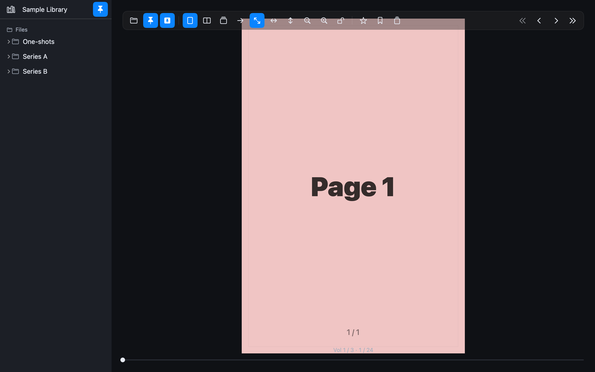
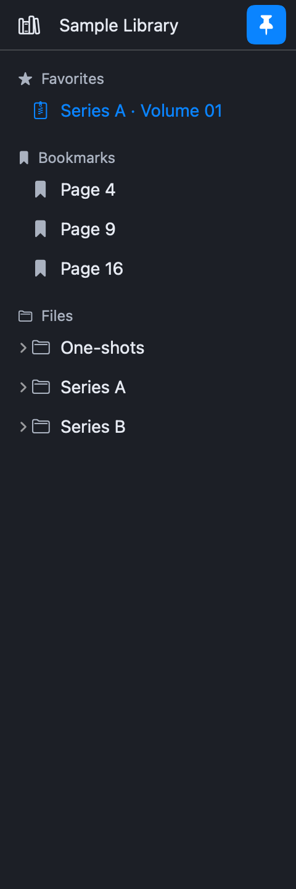
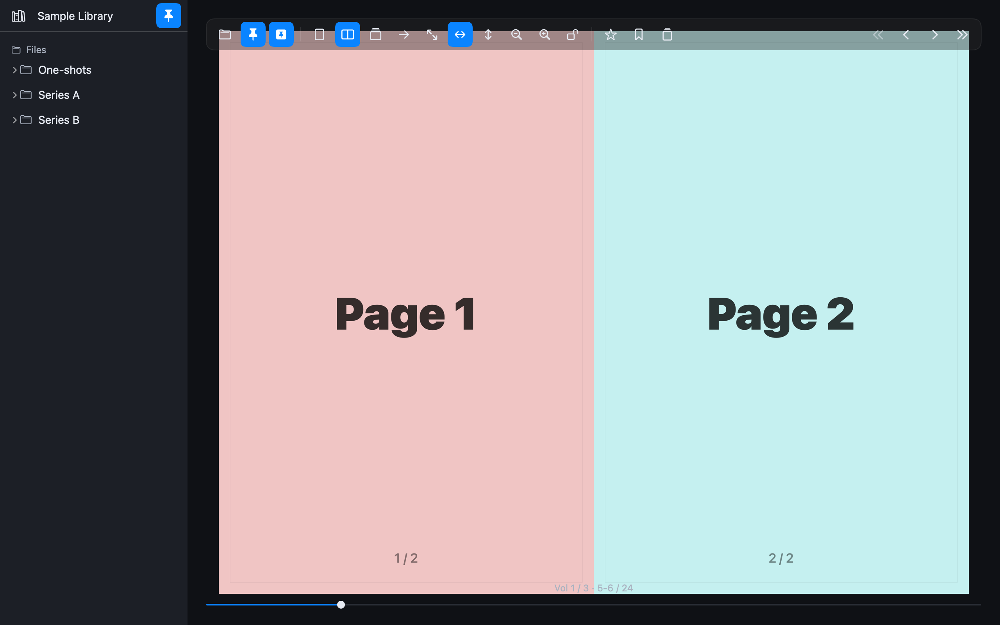
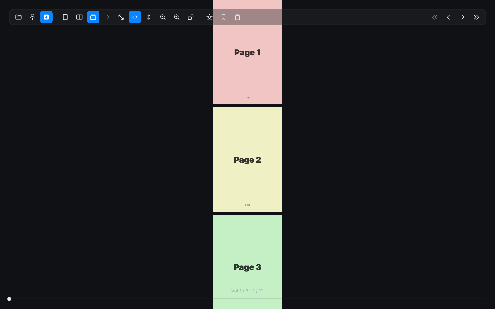
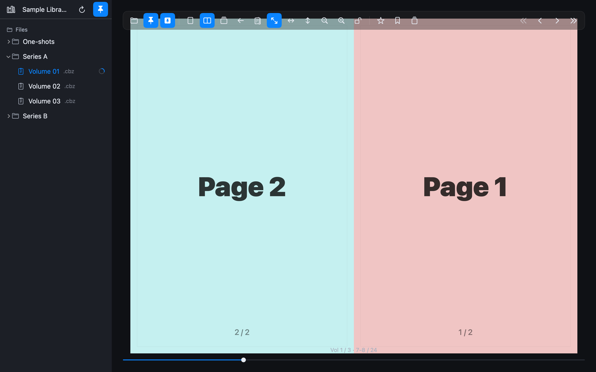
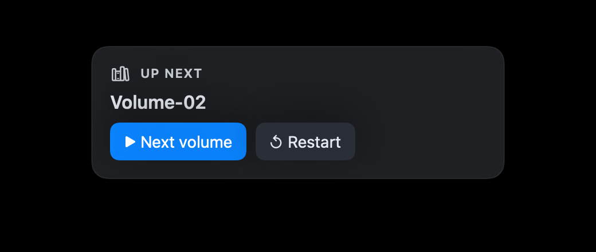
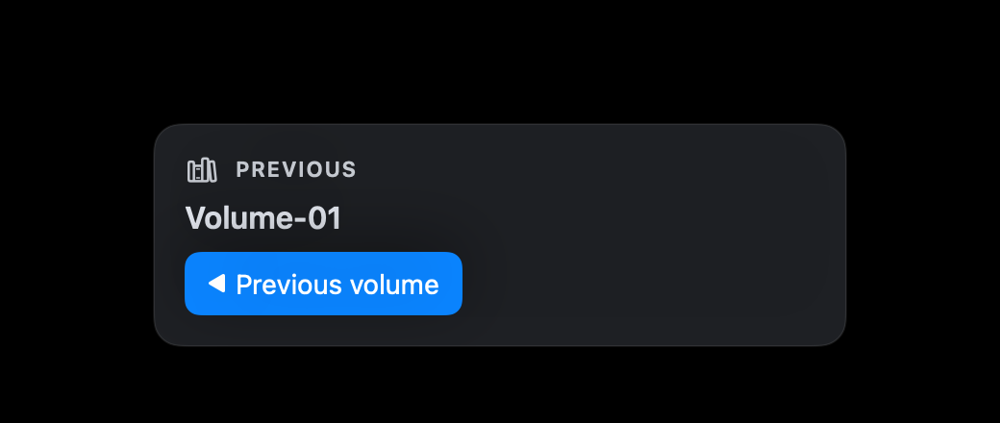
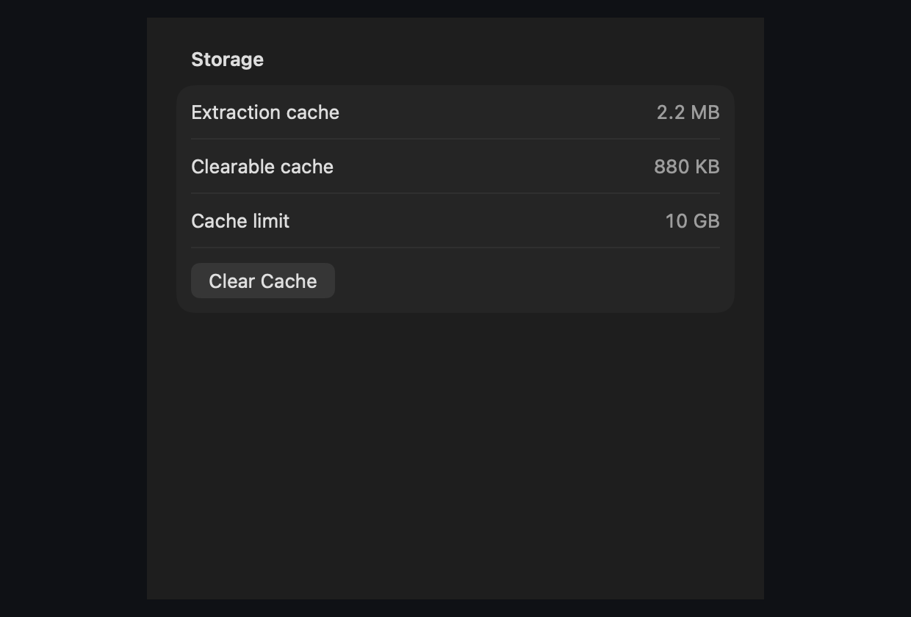
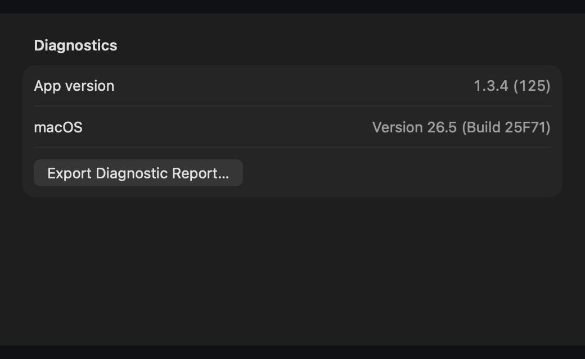

  <a href="manual.md">English</a> · <strong>한국어</strong>

# Panely — 사용 설명서

Panely 리더 인터페이스의 시각적 둘러보기입니다. 전체 기능 목록과 단축키,
빌드 방법은 [README](../README.ko.md)를 참고하세요.

---

## 한눈에 보기

리더는 레이아웃과 무관하게 사용자를 방해하지 않는 크롬을 유지합니다:

- **라이브러리 사이드바** (왼쪽, 고정 가능) — 폴더 트리, 즐겨찾기, 책별 페이지 북마크
- **플로팅 툴바** (위, 자동 숨김) — 레이아웃 / 맞춤 / 줌 / 즐겨찾기 / 북마크 / 네비게이션
- **뷰어** — 페이지 자체. 자동 중앙 정렬, 핀치 + 스크롤 휠 줌 지원
- **페이지 슬라이더** (아래, 자동 숨김) — Quick-jump 필드 + 권/페이지 카운터

---

## 책 열기

처음 실행 시 라이브러리는 비어있습니다:

**Pick Folder…** 를 클릭(또는 `⌘O` 누르거나 폴더를 앱 아이콘으로
드래그)해서 접근 권한을 부여합니다. 한 번 부여되면 사이드바가 트리와 책별
상태로 채워집니다:

사이드바는 자동으로 최대 세 가지 섹션을 노출합니다:

- **Favorites** — ★ 버튼(또는 `⌘⇧D`)으로 별 표시한 책
- **Bookmarks** — 🔖 버튼(또는 `⌘D`)으로 표시한 현재 책의 페이지들
- **Files** — 라이브러리 폴더 트리. 폴더와 아카이브(`.cbz` / `.zip`)가 시각적으로 구분됨

사이드바 상단의 핀 아이콘(또는 `⌃⌘S`)으로 영구 고정 가능. 고정하지
않으면 왼쪽 가장자리에 호버 시 오버레이로 슬라이드 인되고, 마우스가
떠나면 슬라이드 아웃됩니다.

---

## 읽기 레이아웃

세 가지 레이아웃이 모든 읽기 스타일을 커버합니다. `⌘⇧1` / `⌘⇧2` /
`⌘⇧3`로 원하는 모드 직접 선택 — 원치 않는 모드 거치는 사이클 없음.

### 단일 페이지 (`⌘⇧1`)

한 페이지가 뷰어를 채웁니다. 페이지 한 장이 독립적으로 의미를 가지는
포트레이트 스캔에 적합. 다음/이전 컨트롤이 페이지를 한 장씩 넘깁니다.

### 두 페이지 펼침 (`⌘⇧2`)

두 페이지가 나란히 — 실제 책 읽는 경험과 일치합니다. 두 페이지가
병렬로 디코드되어 스프레드 전환이 빠릅니다. 아래의 RTL 방향과 함께
쓰면 자연스러운 만화 셋업이 됩니다.

### 세로 스크롤 (`⌘⇧3`)

위→아래로 끊김 없이 이어지는 스트립 — 웹툰을 위해 설계됨. 스크롤하면
페이지가 lazy하게 스트림되고, 뷰포트를 벗어난 페이지는 placeholder로
돌아가서 1000페이지 스트립이라도 모든 이미지를 메모리에 고정하지
않습니다.

### 만화용 우→좌 (RTL) 읽기

읽기 방향 토글(툴바 화살표 버튼)로 만화 읽기 순서를 뒤집습니다. RTL은
페이지 레이아웃에만 적용 — 세로 스크롤은 항상 위→아래로 읽으므로 세로
모드에서는 방향 토글이 자동 비활성화됩니다.

---

## 툴바

왼쪽에서 오른쪽으로 그룹화:

1. **Chrome** — 파일 열기(`⌘O`), 라이브러리 고정(`⌃⌘S`), 툴바 고정(`⌃⌘T`)
2. **레이아웃** — 단일 / 이중 / 세로, 그리고 읽기 방향 토글
3. **맞춤 & 줌** — 화면 / 가로 / 세로 맞춤(`⌘1`/`⌘2`/`⌘3`), 줌 인/아웃(`⌘+`/`⌘−`), 뷰 크기 잠금(`⌘L`)
4. **북마크** — 책 즐겨찾기(`⌘⇧D`), 페이지 북마크(`⌘D`), 썸네일 사이드바 토글(`⌃⌘P`)
5. **네비게이션** (오른쪽 끝) — 이전/다음 권(`⌘[`/`⌘]`), 이전/다음 페이지(`←`/`→`)

툴바는 커서가 상단 가장자리에서 벗어나면 자동으로 숨겨집니다. `⌃⌘T`로
읽는 동안 계속 표시하도록 고정할 수 있습니다.

---

## 페이지 네비게이션

하단 슬라이더 영역에는:

- **권 + 페이지 카운터** (`Vol 1 / 3 · 1 / 24`) — 현재 형제 권의 인덱스와 책 내 페이지 위치
- **Quick-jump 필드** — 클릭 후 페이지 번호 입력, Return으로 이동
- **슬라이더** — 책 전체를 드래그해서 시각적으로 탐색

슬라이더는 툴바와 같은 자동 숨김 규칙을 따릅니다. 하단 가장자리에 호버
시 다시 나타나며, `⌃⌘T`로 둘 다 고정할 수 있습니다.

큰 점프가 필요할 때는 **Go to Page…** 프롬프트(`⌘G`)가 1부터 전체
페이지 수까지의 번호를 받아 범위를 벗어나면 조용히 클램프합니다.

---

## 권 연속 읽기

같은 폴더 안의 여러 파일로 구성된 시리즈에서, Panely는 그 파일들을
형제 권으로 인식하고 권 경계에서 이동 카드를 표시합니다.

### 권 끝

현재 권의 마지막 페이지에 도달하고 다음 형제가 있으면 뷰어 하단에
**Up next** 카드가 나타납니다. 다음 권의 파일명을 보여줘서 무엇이
시작될지 알 수 있습니다. `→` 또는 `Space` 한 번(또는 **Next volume**
클릭)으로 다음 권을 로드합니다. **Restart** 는 현재 권을 1페이지로
되감습니다.

### 이전 권

첫 권이 아닌 권의 0페이지에서 `←` 를 누르면 **Previous** 카드가
무장됩니다. 한 번 더 뒤로 누르면 이전 권으로 이동합니다.

이 카드는 의도 게이트가 적용됨 — 매번 0페이지에서 자동으로 뜨지 않아서
Vol 2를 처음 열었을 때 Vol 1에 대해 잔소리하지 않습니다. 명시적인
backward 신호가 있어야 표시됩니다.

---

## 로딩 상태

무거운 작업은 중앙 오버레이로 현재 단계를 표시해서 무엇이 진행 중인지
항상 알 수 있게 합니다:

- **Opening…** — 파일 초기 검사
- **Analyzing archive…** — 중첩 아카이브 확인
- **Extracting archive…** — zip-in-zip 압축 해제 (5 GB 안전 상한)
- **Scanning folder…** — 디렉터리에서 페이지 목록 빌드
- **Loading pages…** — 이미지 데이터 디코드
- **Building vertical strip…** — 웹툰 모드용 lazy window 레이아웃

추출과 디코딩 모두 백그라운드 스레드에서 실행되므로 UI는 내내
반응성을 유지합니다.

성공적으로 추출된 zip-in-zip 아카이브는
`~/Library/Caches/panely-extraction-cache/`에 캐시됩니다 (10 GB 예산,
LRU 정리). 따라서 같은 아카이브를 다시 열 때는 즉시 표시됩니다.

---

## 저장 공간과 캐시

**File → Settings…**(또는 **Panely → Settings…**)의 Storage 탭에서
zip-in-zip 추출 캐시 용량을 확인하고 비울 수 있습니다.

- **Extraction cache** — 추출된 중첩 아카이브가 현재 디스크에서
  사용하는 전체 용량.
- **Clearable cache** — 즉시 삭제 가능한 용량. 현재 책이 캐시된 추출
  디렉터리에서 열려 있으면 해당 활성 캐시 entry는 읽기를 끊지 않도록
  보존됩니다.
- **Cache limit** — 자동 LRU 예산(10 GB).
- **Clear Cache** — 삭제 가능한 추출 캐시를 제거하고 용량을 다시 계산.

같은 정리는 **File → Clear Extraction Cache** 에서도 실행할 수 있습니다.
책을 로딩하거나 압축 해제 중일 때는 캐시 삭제가 비활성화됩니다.

## 진단

**Settings → Diagnostics** 에서 **Export Diagnostic Report…** 를 누르면
버그 리포트에 첨부할 수 있는 zip을 생성합니다. 포함 내용:

- 앱 버전/build와 macOS 버전.
- 최근 Panely 로그.
- 파일 경로가 filename, extension, type 수준으로 redacted 된 최근 열기/로드 이벤트.
- 추출 캐시 용량, 현재 reader 설정, 마지막 reader 에러.

---

## 북마크와 즐겨찾기

### 책 즐겨찾기

책을 연 상태에서 `⌘⇧D` (또는 ★ 툴바 버튼)를 누르면 사이드바의
**Favorites** 섹션에 추가됩니다. 즐겨찾기는 security-scoped bookmark로
실행 간 유지되며, 같은 볼륨 내에서 파일이 이동되어도 stale bookmark가
즉시 재생성되어 계속 동작합니다.

### 페이지 북마크

`⌘D` (또는 🔖 툴바 버튼)로 현재 페이지를 사이드바의 **Bookmarks** 섹션에
표시합니다. 각 책은 자체 목록을 가지며(책당 500개 / 총 200권 상한),
zip-in-zip 임시 디렉터리 재추출에도 살아남는 안정적인 식별자로 관리됩니다.

`⌘⇧[` / `⌘⇧]` 로 현재 책 내의 북마크 사이를 이동할 수 있습니다.

---

## 키보드 단축키

전체 목록은
[README → 단축키와 제스처](../README.ko.md#단축키와-제스처) 참조.
가장 많이 쓰는 것들:

| 동작 | 단축키 |
|---|---|
| 다음 / 이전 페이지 | `→` / `←` (다음은 `Space` 도 가능) |
| 다음 / 이전 권 | `⌘]` / `⌘[` |
| 파일 열기 | `⌘O` |
| 페이지 번호로 이동… | `⌘G` |
| 페이지 북마크 추가/제거 | `⌘D` |
| 책 즐겨찾기 추가/제거 | `⌘⇧D` |
| 레이아웃: 단일 / 이중 / 세로 | `⌘⇧1` / `⌘⇧2` / `⌘⇧3` |
| 맞춤: 화면 / 가로 / 세로 | `⌘1` / `⌘2` / `⌘3` |
| 줌 인 / 아웃 / 리셋 | `⌘+` / `⌘−` / `⌘0` |
| 라이브러리 / 툴바 / 썸네일 고정 | `⌃⌘S` / `⌃⌘T` / `⌃⌘P` |
| 뷰 크기 잠금 | `⌘L` |
